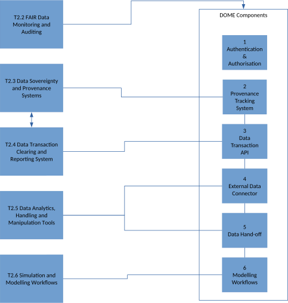

.. _T1.2: 

Tools and Services
==================

This repository is to help with planning and prioritisation of tasks in WP2.

A rough overview of the tasks in WP2 and how they related to components of the DOME platform is shown here:

   
Personae
--------

The central registry of personae can be found in the `document for T1.2 <https://teams.microsoft.com/_#/docx/viewer/teams/https:~2F~2Fsintef.sharepoint.com~2Fteams~2FDOME4.0~2FDelte%20dokumenter~2FWP1~2FTask%201.2~2FDOME%204.0%20Deliverable%20D1.2%20Use%20case_%20persona%20and%20requirements%20registry%20V0.2.docx?threadId=19:5fd41015b3b646d2b74558305ba5f043@thread.tacv2&baseUrl=https:~2F~2Fsintef.sharepoint.com~2Fteams~2FDOME4.0&fileId=84a1996c-a2e2-4aee-a114-1793de00a9d9&ctx=files&rootContext=items_view&viewerAction=view>`_.  
When choosing or adding personae for user stories this should be used as a reference.
